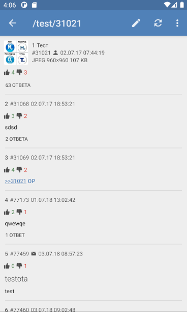
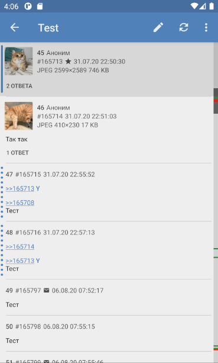
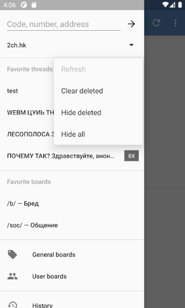

# DashchanFork

Android client for imageboards.

## Features

* Supports multiple forums using extensions
* Threads watcher and reply notifications
* Automatic filter using regular expressions
* Image gallery and video player
* Archiving in HTML format
* Configurable themes
* Fullscreen layout

## Screenshots

<p>


</p>

## Changes in DashchanFork:

* Added support for voting like on some boards, for example 2ch.hk/news/ (only works with updated extension)
* Added the ability to hide threads with a swipe (activated in the settings)
* Fix app freezes while downloading when download folder contains many files
* Reworked ClickableToast, may fix display on some Android systems
* Google Search now uses Google Lens
* Added the ability to activate multi-threaded playback for videos (may improve performance)
* Captcha timer support with automatic reload for imageboards where this is supported
* Hiding the list of favorite threads
* Some interface improvements, with the ability to border highlight your posts and see your posts and replies on the scrollbar

## Screenshots





## Building Guide

1. Install JDK 8 or higher
2. Install Android SDK, define `ANDROID_HOME` environment variable or set `sdk.dir` in `local.properties`
3. Run `./gradlew assembleRelease`

The resulting APK file will appear in `build/outputs/apk` directory.

### Build Signed Binary

You can create `keystore.properties` in the source code directory with the following properties:

```properties
store.file=%PATH_TO_KEYSTORE_FILE%
store.password=%KEYSTORE_PASSWORD%
key.alias=%KEY_ALIAS%
key.password=%KEY_PASSWORD%
```

### Building Extensions

The source code of extensions is available in
[Dashchan Extensions](https://github.com/Mishiranu/Dashchan-Extensions) repository(original from Mishiranu).
[Dashchan Extensions](https://github.com/Mishiranu/Dashchan-Extensions) repository(specifically for the fork with new modules and included updates).

The source code of the video player libraries extension is available in
[Dashchan Webm](https://github.com/Mishiranu/Dashchan-Webm) repository.

## License

Dashchan is available under the [GNU General Public License, version 3 or later](COPYING).
